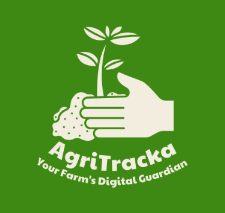
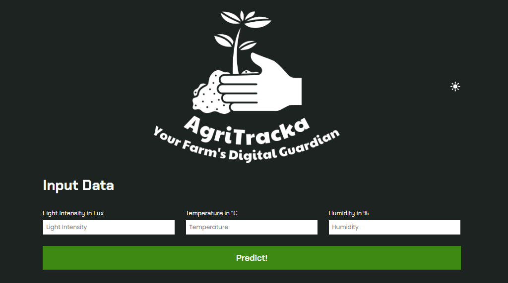
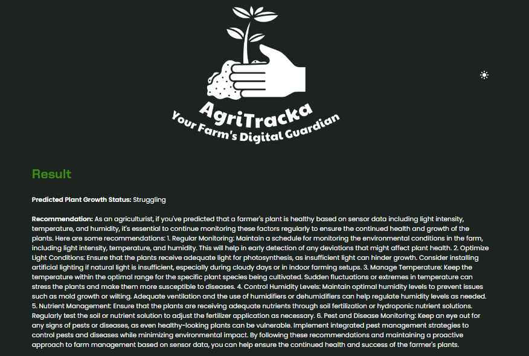
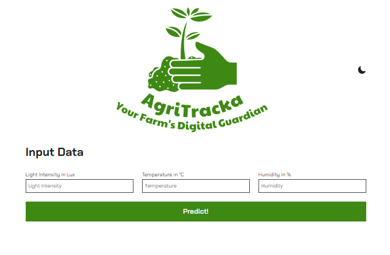
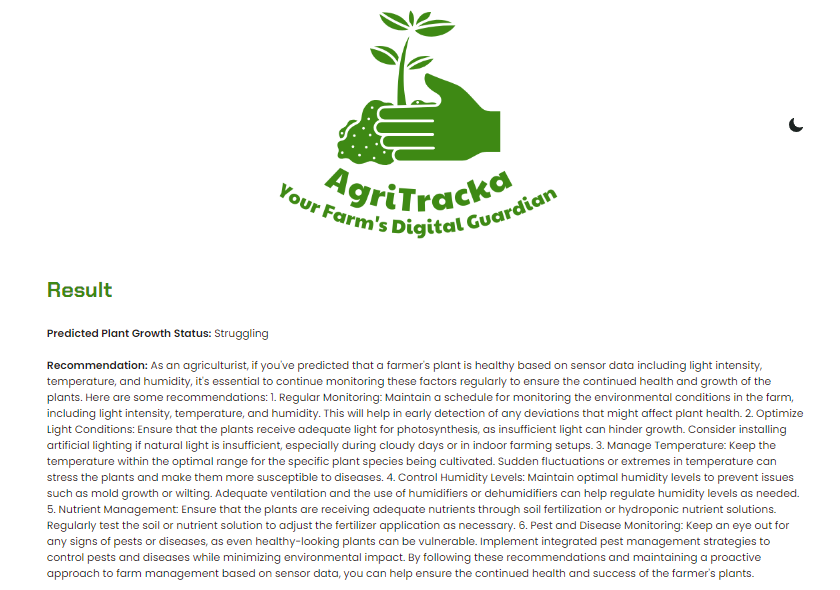

### AgriTracka: Your Farm's Digital Guardian



#### Introduction
AgriTracka is a Flask web application designed to assist farmers in monitoring and managing their crops' health. By integrating hardware sensors to capture environmental data and utilizing machine learning models for predictive analysis, AgriTracka offers personalized recommendations to optimize crop growth conditions. This README provides an overview of the technology used, setup instructions, key features, and how to work with the application locally.


---

#### Key Features
- **Real-time Data Analysis**: AgriTracka collects data from hardware sensors in real-time, including light intensity, temperature, and humidity, to provide up-to-date insights into crop health.
- **Predictive Analysis**: Utilizing a pre-trained machine learning model, AgriTracka predicts the health status of plants based on environmental parameters, helping farmers identify potential issues early.
- **Personalized Recommendations**: Leveraging the Azure OpenAI API, AgriTracka generates personalized recommendations tailored to specific plant conditions, offering actionable insights to improve growth conditions.
- **User-friendly Interface**: AgriTracka features an intuitive web interface that allows farmers to easily input sensor data, view predictions, and receive recommendations with minimal effort.
- **Local Deployment**: Farmers can deploy AgriTracka locally, enabling them to access and utilize the application directly from their farm without relying on external servers.

---
#### Images

##### Dark Mode: 





##### Light Mode: 




---

#### Technology Used
- **Flask**: Python web framework for building the application.
- **Azure App Service** for Deployment
- **Pandas**: Library for data manipulation and analysis.
- **Joblib**: Library for loading pre-trained machine learning models.
- **OpenAI API**: Azure-based API for Generative Text AI.
- **HTML/CSS**: For frontend design and layout.
- **Markdown2**: Library for converting Markdown to HTML.
- **dotenv**: Library for loading environment variables from a `.env` file.

---

The `Plant_Status_ML_Model.ipynb` file contains the Machine Learning/Data Analytics part of the code, which involves training predictive models based on the `plant_monitoring_dataset.xlsx` dataset. Here's an explanation of the workflow:

1. **Loading the Dataset**: 
   - The notebook starts by loading the `plant_monitoring_dataset.xlsx` file, which contains columns for light intensity, temperature, humidity, and the corresponding plant health status. This dataset serves as the training data for the machine learning models.

2. **Data Preprocessing**:
   - Before training the models, the dataset may undergo preprocessing steps such as handling missing values, encoding categorical variables (if any), and scaling numerical features if necessary. These steps ensure that the data is in a suitable format for model training.

3. **Model Training**:
   - Next, the notebook trains two different machine learning models on the dataset: Gradient Boosting and Random Forest.
   - Each model is trained using the features (light intensity, temperature, humidity) as inputs and the plant health status as the target variable.
   - The training process involves fitting the models to the training data, allowing them to learn patterns and relationships between the input features and the target variable.

4. **Model Evaluation**:
   - After training, the notebook evaluates the performance of each model using appropriate evaluation metrics, such as accuracy, precision, recall, or F1-score.
   - The evaluation metrics help determine which model performs better in predicting plant health status based on the given features.

5. **Model Selection**:
   - Based on the evaluation results, the notebook selects the better-performing model between Gradient Boosting and Random Forest.
   - The selection criterion may vary depending on the specific requirements and goals of the project. For example, if accuracy is the primary concern, the model with the highest accuracy may be chosen.

6. **Saving the Model**:
   - Finally, the selected model is saved using the joblib library. The model is serialized and stored as a file named `plant_growth_model.joblib`.
   - Saving the model allows for easy retrieval and deployment in other parts of the project, such as the Flask application for plant health prediction.

**Additional Information**:
- `plant_monitoring_dataset.xlsx`: This Excel sheet contains columns representing the light intensity, temperature, humidity, and plant health status. The plant health status serves as the target variable, and the other columns are the features used for predicting the plant's health. This dataset is created as a dummy dataset for the purpose of this project, mimicking real-world scenarios where environmental factors influence plant health. 

> The actual dataset can be generated from the setup in the [Hardware Folder](https://gitlab.com/agritracka/AgriTracka-Hardware/).

#### Setup Instructions
1. Clone the repository to your local machine.
2. Install the required dependencies by running `pip install -r requirements.txt`.
3. Create a `.env` file in the project root directory and define the following environment variables:
   - `API_KEY`: Your Azure OpenAI API key.
   - `RESOURCE_ENDPOINT`: Azure OpenAI endpoint.
4. Connect the hardware sensors (light intensity, temperature, humidity) to your Arduino microcontroller and ensure they are functioning properly.
5. Ensure the machine learning model (`plant_growth_model.joblib`) is available in the project directory.
6. Run the Flask application by executing `python app.py` in your terminal.
7. Access the application locally at `http://localhost:5000`.

---

#### Usage
1. Navigate to the home page of the AgriTracka web application.
2. Enter the current light intensity, temperature, and humidity readings obtained from the hardware sensors.
3. Click on the "Predict" button to receive a prediction of the plant's health status.
4. After obtaining the prediction, click on the "Get Recommendation" button to receive personalized recommendations generated by the Azure OpenAI API.
5. View the recommended actions to optimize the plant's growth conditions.

---

#### Note
- Ensure that all necessary dependencies are installed and configured correctly.
- Verify that the hardware sensors are connected and providing accurate readings.
- The application relies on a pre-trained machine learning model for predicting plant health status. Ensure the model (`plant_growth_model.joblib`) is available and up-to-date.
- Properly handle and secure sensitive information such as API keys and endpoints.

---

Try [here](https://agritracka.azurewebsites.net/)

#### Author
[The AgriTracka Team](https://drive.google.com/file/d/1wNPGGXfohR7Q4M426ggvJ1lRbXjCetz9/view?usp=sharing)

#### License
[MIT License](https://opensource.org/license/mit/)

```
