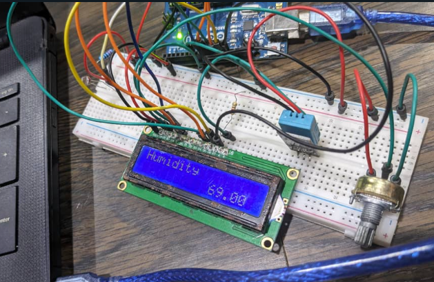
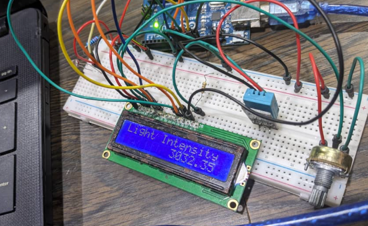
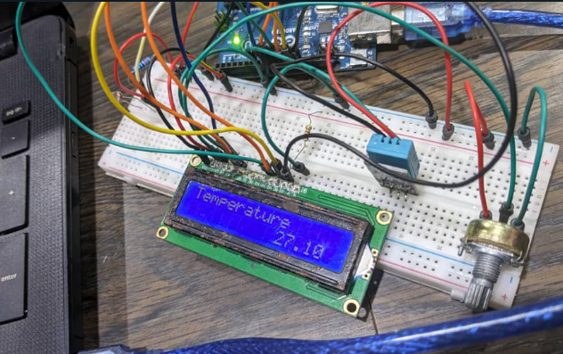

### AgriTracka


This is the hardware part of the solution!

#### Description
AgriTracka is an application designed for agricultural monitoring and management. It utilizes two hardware components: a light intensity sensor - a Photoresistor (a LDR - Light Dependent Resistor) and a DHT11 sensor (i.e. Digital Humidity and Temperature Sensor) for temperature and humidity sensing. These sensors are interfaced with an Arduino microcontroller to collect environmental data, which is then displayed on an LCD screen. The project consists of two main components: `sensing.ino` for data collection and `actuating.ino` for displaying sensor values on the LCD screen.

---

#### Folder Structure

- **sensing**:
  - **sensing.ino**: Arduino code for collecting data from sensors and sending it to the serial monitor and then exported to a spreadsheet using Coolterm, a freeware serial port terminal app and networking program.

- **actuating**:
  - **actuating.ino**: Arduino code for displaying sensor data on the LCD screen.

---

#### Hardware Requirements
- Arduino Uno Microcontroller
- DHT11 Temperature and Humidity Sensor
- Light Intensity Sensor- Photoresistor i.e. a LDR - Light Dependent Resistor
- LCD Screen
- Resistors, wires, and breadboard (for circuit connection)

---

#### Setup Instructions
1. Connect the DHT11 Temperature and Humidity Sensor to the designated pin on the Arduino board.
2. Connect the Light Intensity Sensor to the analog pin of the Arduino board.
3. Wire the LCD screen according to the pin configurations specified in the code (`rs`, `en`, `d4`, `d5`, `d6`, `d7`).
4. Upload the `sensing.ino` code to the Arduino board to read sensor data.
5. Upload the `actuating.ino` code to the Arduino board to display sensor data on the LCD screen.

---

#### Operation
1. Upon powering the Arduino board, the `sensing.ino` code starts collecting data from the sensors.
2. The temperature, humidity, and light intensity readings are displayed on the serial monitor.
3. Simultaneously, the `actuating.ino` code displays the sensor data on the connected LCD screen.
4. The data is updated at regular intervals, providing real-time environmental information.

---
For Humidity:




For Light Intensity:




For Temperature:




#### Note
- Ensure proper connections and configurations as per the hardware setup instructions.
- Adjust the code or hardware components as necessary based on specific requirements or sensor types.

---

Try [here](https://agritracka.azurewebsites.net/)

#### Author
[The AgriTracka Team](https://drive.google.com/file/d/1wNPGGXfohR7Q4M426ggvJ1lRbXjCetz9/view?usp=sharing)

#### License
[MIT License](https://opensource.org/license/mit/)

```
